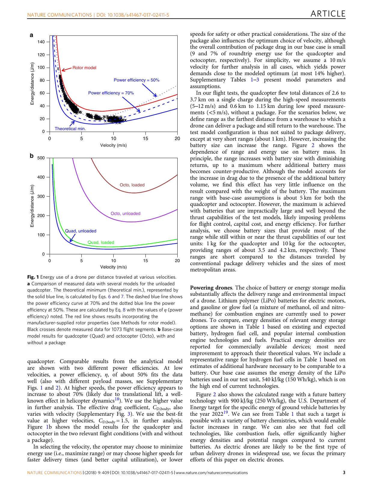
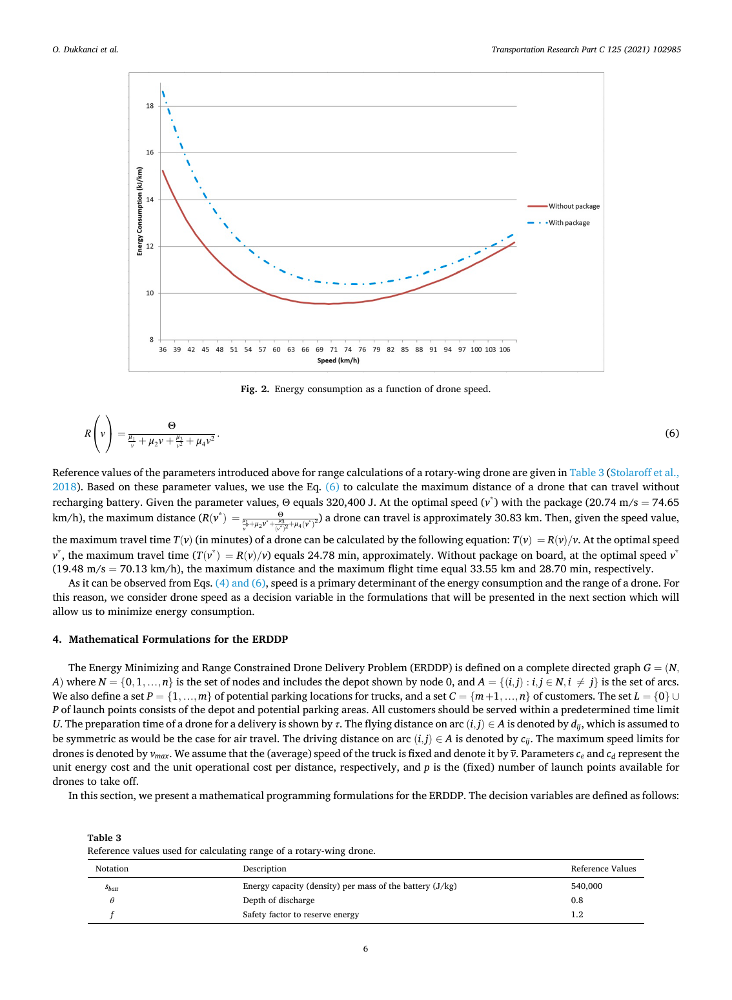
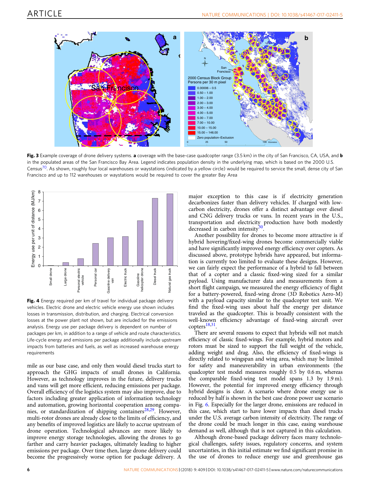
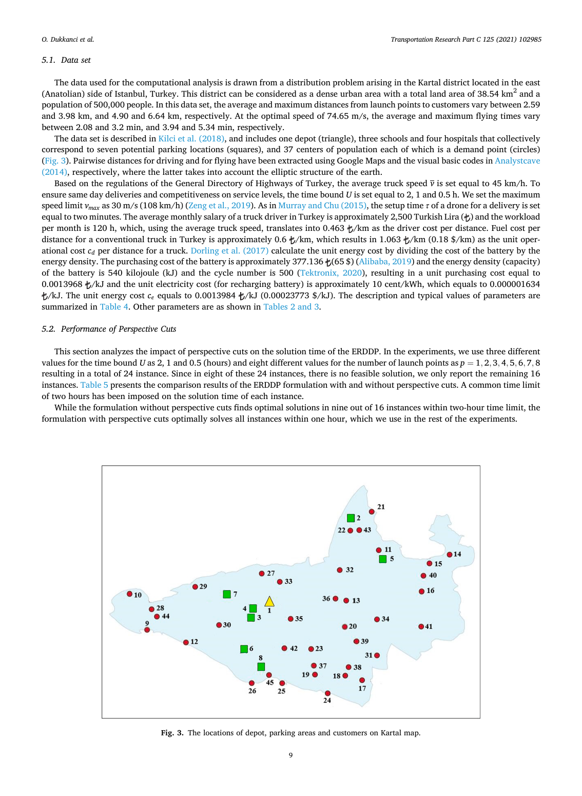
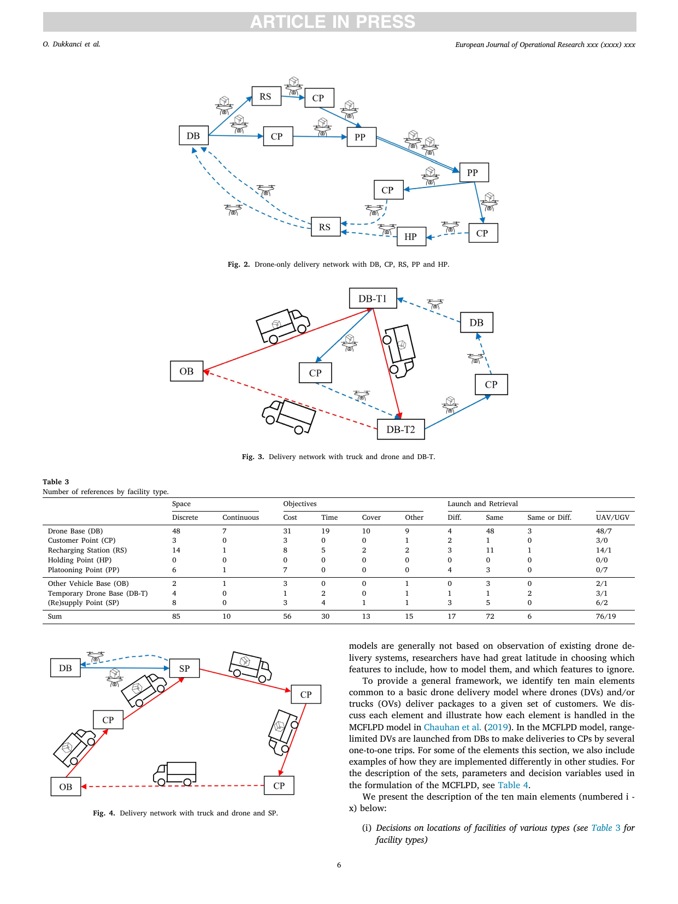
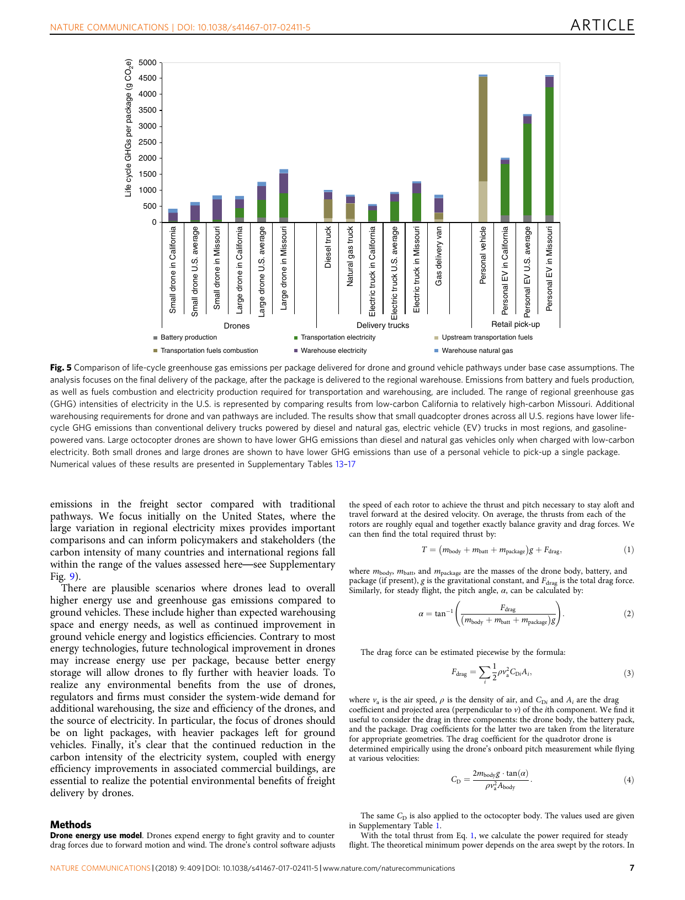
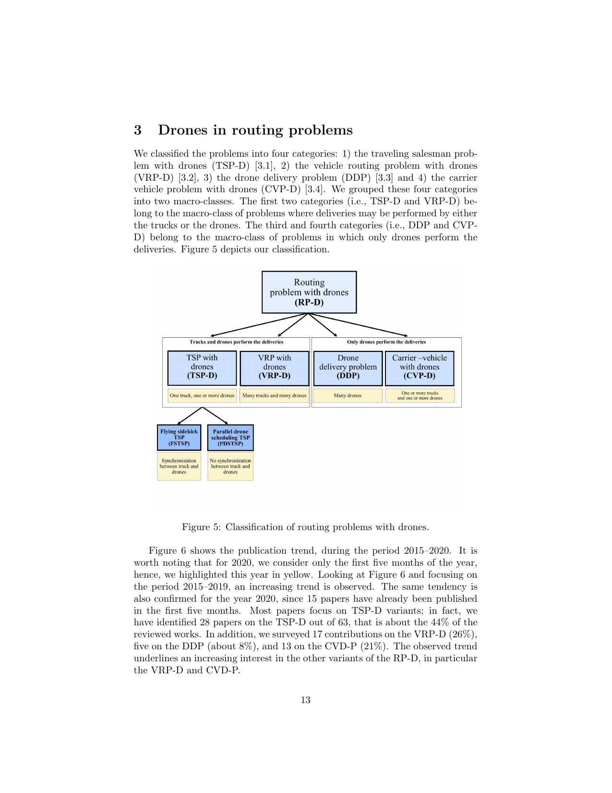
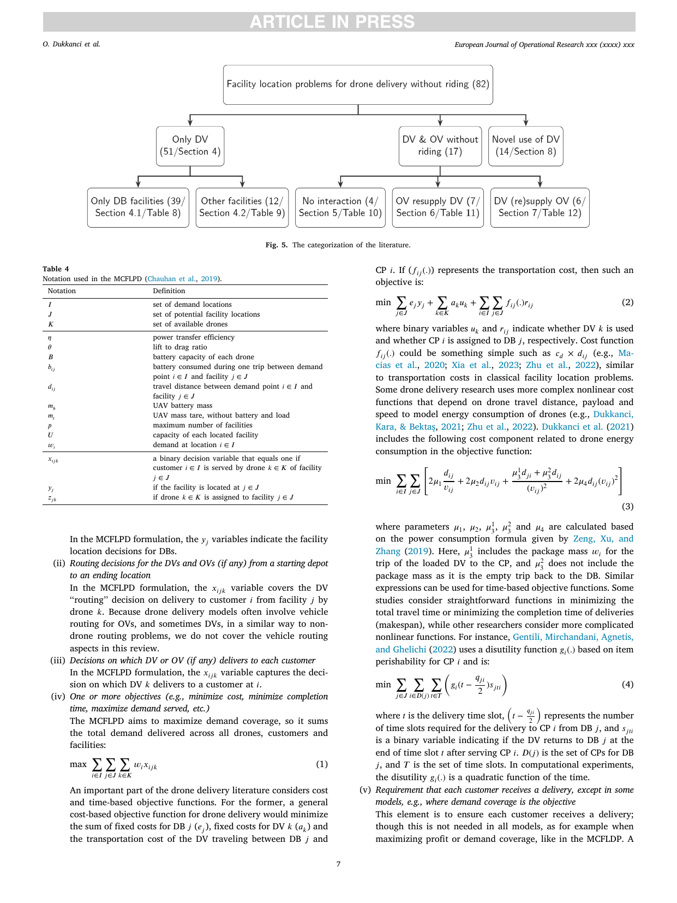
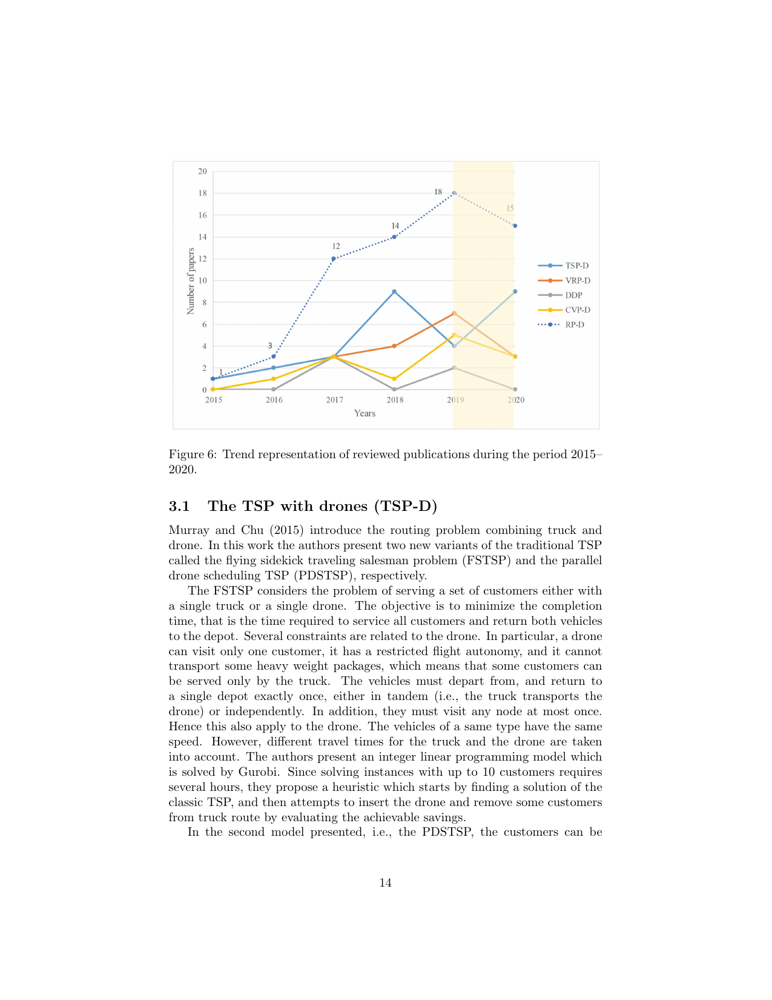
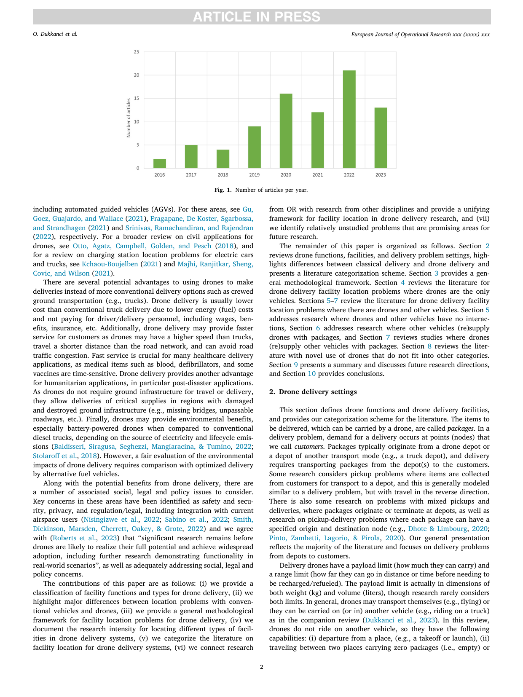

# 相近领域科研图表类型与截图对应说明

本文件将 ARIS `research-lit` 检索到的相近领域论文，按“图表类型—论文截图—图表含义—本文适用性”重新整理。截图均来自已保存的论文 PDF 页面，原始文件位于 `相近一区论文PDF/`。它们用于学习结果表达方式，不直接复制论文图形。

本轮检索得到 293 条去重记录，其中 68 篇来自无人机配送、灾害物流、能源建模、GIS/DEM和遥感相关期刊。具体期刊包括 *Nature Communications*、*Transportation Research Part C/E*、*European Journal of Operational Research*、*Omega*、*Expert Systems with Applications*、*Computers & Industrial Engineering*、*Computers & Operations Research*、*International Journal of Production Economics*、*IEEE TITS/TASE*、*Remote Sensing*、*ISPRS International Journal of Geo-Information* 和 *Earth-Science Reviews* 等。

> 期刊是否属于中科院一区会随年份和评价体系变化。本文件将高影响力、方法相关性强的期刊作为优先参考，不把 OpenAlex 检索结果直接当作中科院分区证明。

## 1. 能耗—速度—载荷响应曲线

### 论文截图





### 图表表达的意思

这类图把速度、载荷、旋翼构型或能源参数作为横纵坐标，展示能耗曲线及其最低点。作者想说明：无人机能耗不是一个固定常数，速度和载荷会改变能量消耗，且不同机型的曲线形状不同。

### 对本文的适用性

本文题目已经给定各机型的飞行速度，因此不能据此增加“速度优化”变量。但该图式可以迁移为：

- 横轴为返航安全余量，纵轴为最大安全载荷；
- 横轴为货箱质量，纵轴为架次能耗；
- 用不同颜色区分A、B、C三种机型；
- 单独标出额定载荷上限和能量受限区间。

本文的爬升能耗采用补充假设，因此如果绘制“水平能耗+爬升能耗”，必须在图注中说明该部分不是直接测量结果。

## 2. 空间底图、DEM和配送航段网络

### 论文截图







### 图表表达的意思

这类图把抽象优化模型放回真实或模拟地图中，用点表示仓库、停车点、客户或服务区，用线表示配送关系。地图负责解释空间结构，旁边的柱图、颜色或标签负责表达距离、覆盖、成本或能耗属性。

### 对本文的适用性

这是本文最应该采用的图表类型。问题一可以展示：

- DEM高程背景；
- 调度中心O01和15个服务区；
- O01到各服务区的直飞航段；
- 航段最大触碰像元高程；
- 去程爬升高度和O01—服务区距离。

本文没有停车点、中转站和多级仓库，因此只能保留“调度中心—服务区—航段”结构，不能照搬论文中的虚构节点。

## 3. 能耗组成和生命周期分解柱图

### 论文截图



### 图表表达的意思

堆叠柱图将总指标拆分为多个组成部分，使读者看到总量由哪些因素共同形成。例如截图中把电池制造、运输燃料、仓储电力等部分分开。

### 对本文的适用性

本文可以借鉴其“组成项分解”思想，但只能拆分模型中已经定义的量：

- 水平巡航能耗；
- 去程带载爬升附加能耗；
- 回程空载爬升附加能耗。

不能加入电池制造、上游燃料、生命周期排放等题目没有提供的数据。该图适合作为最终方案的能耗解释图，不适合作为新的物理模型依据。

## 4. 路由问题分类树和方法流程图

### 论文截图





### 图表表达的意思

分类树不是结果图，而是用来解释研究边界：问题按车辆类型、配送结构、是否有中转点、是否有时间窗等维度分层。

### 对本文的适用性

本文应该采用同样的结构化表达，但内容应改为：

```text
原始节点/货箱/机型/DEM
            ↓
地形航段提取与物理能耗计算
            ↓
最大安全载荷与候选组批
            ↓
ε约束与自适应搜索
            ↓
连续松弛下界与整数核验
            ↓
偏好不确定性与最小最大遗憾
            ↓
最终代表性组批方案
```

这类图适合放在建模方法部分，不能代替具体计算结果。

## 5. 网络路线图和配送结构示意图

### 论文截图


### 图表表达的意思

作者通过网络图说明车辆从哪里出发、经过哪些节点、是否返回基地、是否经过停车点或中转站。路线图强调决策结构，而不是精确地理比例。

### 对本文的适用性

本文可以使用一张简化路线示意图表达“每架次从O01出发，访问一个服务区后返回O01”。但是问题一中每个架次只服务一个服务区，所以不应画成多服务区串行访问路径，也不应提前加入Q2的实体无人机和电池时序。

## 6. 多目标权衡、Pareto前沿和归一化目标图

### 相近论文截图




### 图表表达的意思

这类图用于说明不同目标之间不能同时达到最优，方案沿着目标空间形成权衡关系。高水平运筹论文通常使用真实单位的目标图，并在需要时另给归一化图。

### 对本文的适用性

本文最适合绘制两个真实非支配点：

| 方案 | 架次数 | 总能耗 | 累计作业时间 |
|---|---:|---:|---:|
| 18架次 | 18 | 59.133133 kWh | 32776.517 s |
| 19架次 | 19 | 59.035777 kWh | 34440.489 s |

图中应明确说明：19架次节省能耗，但增加累计作业时间；两者均为非支配方案。不能把只有两个离散解画成连续平滑曲线，也不能把“最小最大遗憾为0”写成不依赖偏好设置的普遍结论。

## 7. 参数敏感性、鲁棒性和可行性阈值曲线

### 相近论文中常见表达

高水平交通与运筹论文通常用“参数变化—重新优化结果”的曲线表达鲁棒性，并用垂直线、阴影或标记区分可行区和不可行区。

### 对本文的适用性

本文安全余量响应图应包含：

- 横轴：返航安全余量；
- 纵轴：架次数、总能耗或累计作业时间；
- 蓝色虚线：原18架次方案失效阈值23.0885%；
- 红色虚线：全部任务的最大可行阈值35.2672%；
- 阴影：整数模型不可行区。

该图比单独列出多个情景表格更容易显示“原方案何时失效”和“重新组批后任务还能维持到哪里”。

## 8. 最终方案配置图和SOC排序图

### 相近论文中常见表达

配送论文通常使用堆叠条图展示各区域、车辆类型和配送质量，再用排序点图或箱线图展示资源余量、风险或服务水平。

### 对本文的适用性

本文可以采用：

- 横向堆叠条图：每个服务区的配送质量按A/B/C型分色；
- 逐架次SOC排序图：横轴为返航SOC，标出20%安全余量和最低SOC瓶颈；
- 颜色区分机型，红色标出S004的C型架次瓶颈。

该图直接解释最终18架次方案，比把全部候选组批绘制出来更符合结果提交要求。

## 9. 不建议直接用于本文的图表



年度发文量柱图适合相关工作综述，不适合问题一结果。类似地，以下图表也不应直接移植：

- 生命周期排放图：本文没有生命周期数据；
- 速度最优曲线：本文速度不是决策变量；
- 多级配送网络图：本文没有停车点或中转站；
- 连续多服务区路线图：问题一每架次只服务一个服务区；
- 纯算法收敛曲线：本文采用精确整数规划，不需要用启发式迭代曲线替代最优性证据。

## 10. 本文最终图表组合

| 图号 | 本文采用的图表 | 对应的论文表达来源 | 主要回答的问题 |
|---|---|---|---|
| 图1 | DEM底图 + O01—服务区航段 + 地形属性散点图 | *Nature Communications* 空间覆盖图；*TRC* 实例地图 | 地形和距离如何改变航段特征？ |
| 图2 | 三机型最大安全载荷可行边界 | *Nature Communications* 能耗/载荷曲线 | 哪些组合由额定载荷限制，哪些由能量限制？ |
| 图3 | 18/19架次Pareto散点 + S008组批差异 | *TRC* 权衡曲线和运筹论文目标空间图 | 两个非支配方案的差异来自哪里？ |
| 图4 | 安全余量响应曲线 + 阈值线 + 不可行阴影 | 鲁棒优化和情景分析论文 | 原方案和全部任务何时失效？ |
| 图5 | 分区配送质量堆叠条图 + SOC排序点图 | 能源分解图和资源余量图 | 最终方案如何覆盖服务区，瓶颈在哪里？ |
| 图6 | 求解流程图 | *TRC* 分类树、EJOR方法分类图 | 三个子问题的建模链条如何衔接？ |

以上六类图表已经生成在[科研级可视化目录](./)，对应脚本为 `science_figures_q1.py`，可用 Python 重新绘制。完整论文检索记录见 `aris_research_lit_q1_raw.json`、`aris_research_lit_q1_compact.json` 和[重点论文清单](相近期刊重点论文清单.md)。
