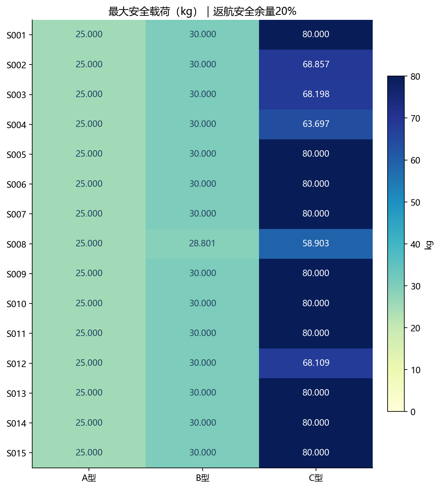
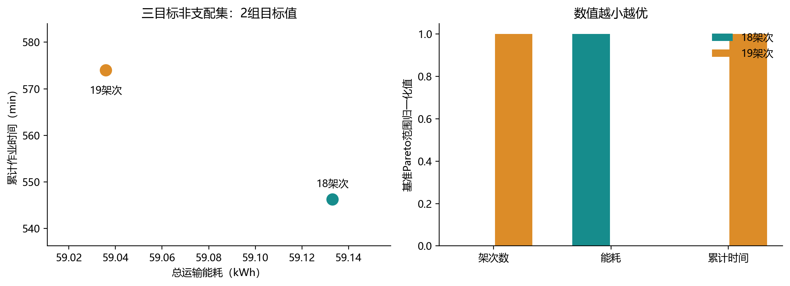
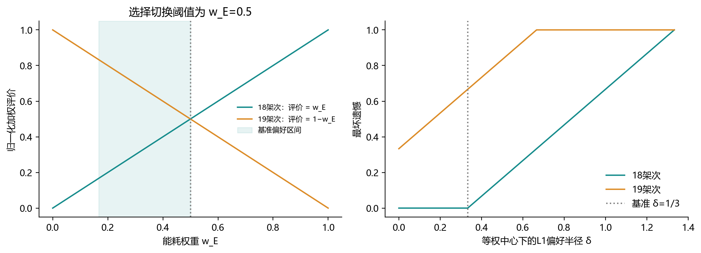
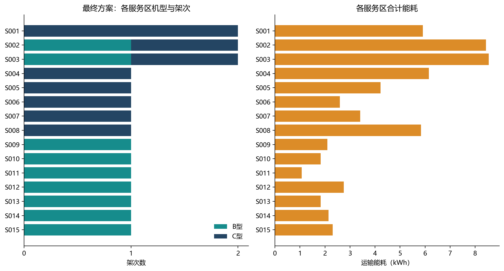
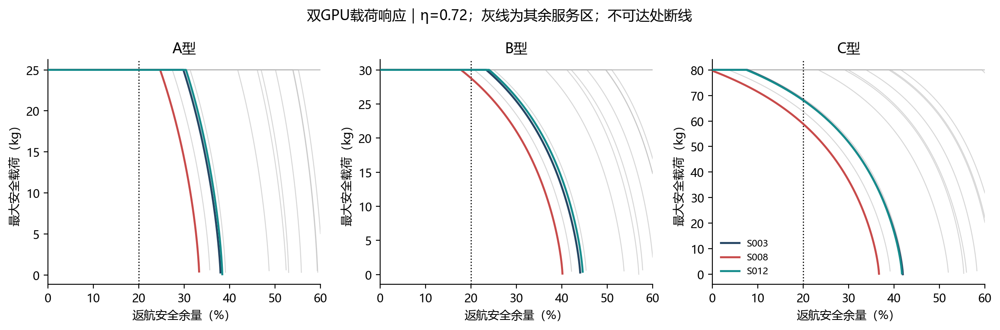
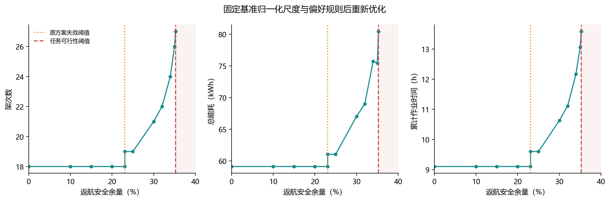

# 问题一求解结果与核验说明

## 科研级可视化（更新版）

根据 ARIS `paper-figure` 与 `figure-spec` 的科研图表规范，新增[科研级可视化目录](科研级可视化/)，包括：

- [图1：地形与航段结构](科研级可视化/图1_地形与航段结构.pdf)：DEM底图、O01—服务区航段及地形属性；
- [图2：载荷可行边界](科研级可视化/图2_载荷可行边界.pdf)：三种机型的额定载荷与能量受限边界；
- [图3：Pareto权衡与组批差异](科研级可视化/图3_Pareto权衡与组批差异.pdf)：两个非支配整数方案及S008组批差异；
- [图4：安全余量鲁棒性](科研级可视化/图4_安全余量鲁棒性.pdf)：安全余量变化下的重新优化响应；
- [图5：最终方案分区配置](科研级可视化/图5_最终方案分区配置.pdf)：分区配送质量与逐架次返航SOC；
- [图6：问题一求解流程](科研级可视化/图6_问题一求解流程.svg)：可编辑的FigureSpec流程图，源文件为同名`.spec.json`。

图表设计参考了无人机优化、无人机—GIS、灾害多无人机调度和能源建模领域的相近研究，具体文献、图注建议和复现方式见[可视化文献依据与图注](科研级可视化/可视化文献依据与图注.md)。原有PNG/PDF仍保留，新图不改变任何模型数值或提交表。

相近期刊的截图、逐图含义、可迁移性判断和图表类型归纳见[相近领域期刊图表类型归纳](科研级可视化/期刊图表类型归纳.md)；完整检索记录见[相近期刊重点论文清单](科研级可视化/相近期刊重点论文清单.md)。

## 1. 最终提交方案

在正文假设1–4、返航安全余量20%、爬升效率0.72、等权偏好中心和L1偏好半径δ=1/3下，最终选择**18架次方案**，完成15个服务区全部80箱、758 kg、2.011 m³物资交付。B型和C型各执行9架次，A型未被选用；这些是架次数，不是实体无人机数量。

总运输能耗为**59.133133081 kWh**，累计作业时间为**32776.516782 s（9.1046累计作业小时）**。累计纯飞行时间为19288.516782 s，最低返航SOC为**23.088493%**。累计作业时间是各架次准备、装载、飞行和交接时间之和，不是全部任务实际完成时刻。

[正式提交表](问题一_结果提交.xlsx)的`Q1_单点组批`只填写这18条最终架次。候选库、另一个非支配方案和敏感性情景另存分析文件，不写入第一问结果表。

### 1.1 原题与模板口径

第一问明确不考虑实体无人机和共享电池调度；医疗与首批保障时限作为调度约束在问题二引入。因此不分配U01等实体编号、不编造电池编号或出发时刻，不将本问方案宣称为已经满足问题二时限与资源约束。

原模板第一问包含服务区、机型、货箱编号列表、质量、体积、往返时间、能耗及SOC。用户所列八列表头属于原模板`Q2_运输架次`；已另存[八列架次视图](子问题二/最终方案_八列架次视图.csv)，不适用的实体无人机、电池、开始时刻和返回绝对时刻四列留空。

第一问表中的“往返时间”采用附录2去程与回程飞行时间之和，含爬升、巡航、下降。准备、装载和交接另计入累计作业时间，两者在[最终方案明细](子问题二/最终方案明细.csv)均列出。交接参数来自机型参数表，因此程序按机型g索引，而非服务区i。

## 2. 子问题一：最大安全载荷与候选组批

直接读取原始节点、机型、逐箱清单和DEM MAT文件，以调度中心为原点建立局部WGS84米制坐标。遍历航段相交的全部DEM像元，以最高高程加50 m确定巡航海拔；去程带载、返程空载。源文件SHA-256见[输入校验](输入文件校验.json)。

### 2.1 三机型、15服务区的最大安全载荷

| 服务区 | A型/kg | B型/kg | C型/kg |
| --- | --- | --- | --- |
| S001 | 25.000000 | 30.000000 | 80.000000 |
| S002 | 25.000000 | 30.000000 | 68.857493 |
| S003 | 25.000000 | 30.000000 | 68.198025 |
| S004 | 25.000000 | 30.000000 | 63.697164 |
| S005 | 25.000000 | 30.000000 | 80.000000 |
| S006 | 25.000000 | 30.000000 | 80.000000 |
| S007 | 25.000000 | 30.000000 | 80.000000 |
| S008 | 25.000000 | 28.800805 | 58.903173 |
| S009 | 25.000000 | 30.000000 | 80.000000 |
| S010 | 25.000000 | 30.000000 | 80.000000 |
| S011 | 25.000000 | 30.000000 | 80.000000 |
| S012 | 25.000000 | 30.000000 | 68.108767 |
| S013 | 25.000000 | 30.000000 | 80.000000 |
| S014 | 25.000000 | 30.000000 | 80.000000 |
| S015 | 25.000000 | 30.000000 | 80.000000 |

45组均可达，39组达到额定载荷；B–S008及C–S002、S003、S004、S008、S012共6组受能量约束。连续最大载荷不保证存在同质量的不可拆箱组合，实际组批仍需满足体积和货箱组成要求。



### 2.2 完整候选库与等价压缩

逐箱可行候选架次共**19525个**。同一服务区内，质量和体积相同的货箱对本问能耗、时间目标可交换。因此枚举“服务区—机型—各规格箱数”得到**732个模式**，删除相同箱数组合下能耗、时间被支配的机型后保留**463个模式**。

模式p对规格t的用箱数记为a_tp，可用数为n_t。实现采用整数次数y_p：

\[
\sum_p a_{tp}y_p=n_t,\quad
y_p\in\mathbb Z_{\ge0},\quad
y_p\le\min_{t:a_{tp}>0}\left\lfloor n_t/a_{tp}\right\rfloor.
\]

整数解按规格从编号池无重复取箱展开；任何逐箱可行方案也能汇总为模式次数，因此与正文逐箱0–1精确覆盖等价。第一问不涉及的时限和实体资源不能被这种可交换性自动处理。

| 服务区 | 逐箱候选数 | 压缩模式数 | 筛选后模式数 |
| --- | --- | --- | --- |
| S001 | 18332 | 201 | 169 |
| S002 | 316 | 76 | 53 |
| S003 | 316 | 76 | 53 |
| S004 | 101 | 51 | 31 |
| S005 | 101 | 51 | 31 |
| S006 | 101 | 51 | 31 |
| S007 | 59 | 43 | 23 |
| S008 | 59 | 43 | 23 |
| S009 | 20 | 20 | 7 |
| S010 | 20 | 20 | 7 |
| S011 | 20 | 20 | 7 |
| S012 | 20 | 20 | 7 |
| S013 | 20 | 20 | 7 |
| S014 | 20 | 20 | 7 |
| S015 | 20 | 20 | 7 |

## 3. 子问题二：ε搜索、下界与最终择优

### 3.1 ε约束与自适应搜索

先解三个单目标整数规划，再以能耗为主目标，限制架次数和累计时间。每取得新点，就把时间上界收紧到所得时间减0.001 s；不采用固定规则网格。

最低能耗方案为19架次。任何架次数大于19的非支配方案，其累计时间必须短于该方案，否则将被支配。在该时间上界内最大化架次数仍得19，所以架次上界只需搜索18与19。

| 方案 | 架次数 | 能耗/kWh | 累计作业时间/s | 最坏遗憾 | 提交 |
| --- | --- | --- | --- | --- | --- |
| PF001 | 18 | 59.133133081 | 32776.516782 | 0.000000000 | 是 |
| PF002 | 19 | 59.035777463 | 34440.488752 | 0.666666667 | 否 |

5个区域中3次返回整数最优点（含1个重复目标点），2次证实整数不可行，活动区域全部穷尽。本例各区域LP均可行，**未发生LP不可行剪枝**；LP可行不代表整数可行。[搜索日志](子问题二/自适应epsilon搜索日志.csv)

独立动态规划进一步确认全局非支配目标集同样只有2个点。这里统计的是目标向量；同规格货箱编号互换可能形成多个等价的最优编号方案。



### 3.2 连续松弛下界

| 目标 | LP下界 | 整数最优值 | 相对差距 |
| --- | --- | --- | --- |
| N | 16.394444 | 18.000000 | 8.9198% |
| E_kWh | 57.358018 | 59.035777 | 2.8419% |
| T_s | 30054.056479 | 32776.516782 | 8.3061% |

此处差距是整数模型与LP松弛的结构性差距，不是求解器未收敛的MIP gap。整数子问题均检查最优状态、整数性和原始约束；日志另存求解器对偶界、MIP gap及耗时。

### 3.3 偏好不确定性与最小最大遗憾

采用已核实非支配集的理想点及最差分量进行归一化：

\[
\mathbf f^{min}=(18,\ 59.035777463,\ 32776.516782),\\
\mathbf f^{max}=(19,\ 59.133133081,\ 34440.488752).
\]

18与19架次方案分别归一化为(0,1,0)、(1,0,1)。基准w⁰=(1/3,1/3,1/3)、δ=1/3是本次声明的决策设置，不是题目参数。偏好集合有6个极点，1/6≤w_E≤1/2；两方案评价分别为w_E和1−w_E。所以18架次方案在基准权重集合内均不劣，最大遗憾为0，而19架次为2/3。

程序还在完整整数可行域求解极小极大模型，避免仅在已发现档案中择优：

\[
\min_{y,r}r,\qquad
(\mathbf w^v)^\mathsf T\bar{\mathbf f}(y)-\Phi^*(\mathbf w^v)\le r,\quad\forall v.
\]

极点最优值Φ*来自完整加权整数规划；最小最大遗憾模型的下界和最终遗憾均为0。同遗憾时，用三个归一化目标的正权和破同优。全单纯形情景下两方案最大遗憾均为1，按此规则选18架次。

| 偏好中心 | δ | 架次数 | 能耗/kWh | 累计时间/s | 最大遗憾 |
| --- | --- | --- | --- | --- | --- |
| 偏重时间 | 0.333333 | 18 | 59.133133 | 32776.517 | 0.000000 |
| 偏重架次 | 0.333333 | 18 | 59.133133 | 32776.517 | 0.000000 |
| 偏重能耗 | 0.333333 | 19 | 59.035777 | 34440.489 | 0.133333 |
| 等权 | 0.000000 | 18 | 59.133133 | 32776.517 | 0.000000 |
| 等权 | 0.166667 | 18 | 59.133133 | 32776.517 | 0.000000 |
| 等权 | 0.333333 | 18 | 59.133133 | 32776.517 | 0.000000 |
| 等权 | 0.666667 | 18 | 59.133133 | 32776.517 | 0.333333 |
| 等权 | 1.333333 | 18 | 59.133133 | 32776.517 | 1.000000 |

偏重能耗w⁰=(0.2,0.6,0.2)、δ=1/3时会选择19架次。这表明“最终最优”以已声明偏好集合为条件，并非三项目标同时更优。



### 3.4 权衡来源与最终方案

两组目标值的区别全部来自S008：18架次方案使用1个C型架次运45 kg；19架次方案改用2个B型架次，分别运20、25 kg。增加1架次节省0.097355618 kWh（0.1646%），同时增加1663.971970 s（27.7329 min）累计作业时间。

| 架次 | 服务区 | 机型 | 箱数 | 质量/kg | 体积/m³ | 飞行往返/s | 累计作业/s | 能耗/kWh | 返航SOC |
| --- | --- | --- | --- | --- | --- | --- | --- | --- | --- |
| Q1-001 | S001 | C | 6 | 76 | 0.170 | 618.175 | 1494.175 | 2.917624 | 63.5297% |
| Q1-002 | S001 | C | 9 | 78 | 0.224 | 618.175 | 1692.175 | 2.995812 | 62.5524% |
| Q1-003 | S002 | C | 5 | 56 | 0.144 | 1231.842 | 2041.842 | 5.721394 | 28.4826% |
| Q1-004 | S002 | B | 3 | 25 | 0.067 | 1186.724 | 1816.724 | 2.713502 | 32.1625% |
| Q1-005 | S003 | C | 5 | 56 | 0.144 | 1560.178 | 2370.178 | 5.765456 | 27.9318% |
| Q1-006 | S003 | B | 3 | 25 | 0.067 | 1450.610 | 2080.610 | 2.780147 | 30.4963% |
| Q1-007 | S004 | C | 6 | 59 | 0.156 | 1425.055 | 2301.055 | 6.152921 | 23.0885% |
| Q1-008 | S005 | C | 6 | 59 | 0.156 | 1001.189 | 1877.189 | 4.222182 | 47.2227% |
| Q1-009 | S006 | C | 6 | 59 | 0.156 | 685.553 | 1561.553 | 2.597981 | 67.5252% |
| Q1-010 | S007 | C | 5 | 45 | 0.129 | 1097.601 | 1907.601 | 3.411076 | 57.3616% |
| Q1-011 | S008 | C | 5 | 45 | 0.129 | 1389.712 | 2199.712 | 5.836066 | 27.0492% |
| Q1-012 | S009 | B | 3 | 25 | 0.067 | 928.463 | 1558.463 | 2.096290 | 47.5928% |
| Q1-013 | S010 | B | 3 | 25 | 0.067 | 925.404 | 1555.404 | 1.823259 | 54.4185% |
| Q1-014 | S011 | B | 3 | 25 | 0.067 | 558.425 | 1188.425 | 1.073963 | 73.1509% |
| Q1-015 | S012 | B | 3 | 25 | 0.067 | 1292.827 | 1922.827 | 2.752644 | 31.1839% |
| Q1-016 | S013 | B | 3 | 25 | 0.067 | 880.512 | 1510.512 | 1.824864 | 54.3784% |
| Q1-017 | S014 | B | 3 | 25 | 0.067 | 1239.748 | 1869.748 | 2.140365 | 46.4909% |
| Q1-018 | S015 | B | 3 | 25 | 0.067 | 1198.328 | 1828.328 | 2.307588 | 42.3103% |

完整货箱编号见正式Excel与CSV。全部货箱恰好交付一次，各架次仅服务一个服务区，质量、体积和20%返航SOC约束逐架次复核通过。



## 4. 子问题三：安全余量与效率敏感性

### 4.1 连续载荷与可行性阈值

双GPU计算45组服务区—机型、1201个安全余量、5个爬升效率，共270225组双精度载荷点。安全载荷随安全余量单调不增，不可达单独记为NaN，不与可行但零载荷混同。



原18架次方案的最大统一安全余量为**23.088493097%**，瓶颈是S004的59 kg C型架次；超过此值需要重新组批。

允许重新组批时，任务最大可行安全余量为**35.267199786%**。第一问不限制架次及实体资源，每个货箱单独可飞是可行的充要条件：必要性来自能耗随载荷不减，充分性由每箱单独成架次构造。因此

\[
\rho^{feas}=\min_b\max_{g:\,m_b\le Q_g,\,v_b\le V_g}
\left(1-\frac{F_{g,i(b)}(m_b)}{E_g^{use}}\right).
\]

瓶颈是S008的14 kg饮用水货箱，最佳机型为C型。临界点仍有27架次可行方案，临界点上方0.000001由整数模型证实不可行。

### 4.2 重新优化的组批响应

各情景保持基准归一化尺度、等权中心和δ不变，重新生成可行模式并求解遗憾模型。只改变电量预算，固定能耗校准电量；归一化值允许超出[0,1]，不截断、不逐情景重标度。

| 安全余量 | 可行 | 架次数 | B型/C型 | 能耗/kWh | 累计时间/s |
| --- | --- | --- | --- | --- | --- |
| 0.000000% | 是 | 18 | 9/9 | 59.133133 | 32776.517 |
| 10.000000% | 是 | 18 | 9/9 | 59.133133 | 32776.517 |
| 15.000000% | 是 | 18 | 9/9 | 59.133133 | 32776.517 |
| 20.000000% | 是 | 18 | 9/9 | 59.133133 | 32776.517 |
| 23.088393% | 是 | 18 | 9/9 | 59.133133 | 32776.517 |
| 23.088593% | 是 | 19 | 10/9 | 61.075221 | 34566.158 |
| 25.000000% | 是 | 19 | 10/9 | 61.075221 | 34566.158 |
| 30.000000% | 是 | 21 | 11/10 | 67.023295 | 38262.658 |
| 32.000000% | 是 | 22 | 12/10 | 69.015521 | 40005.485 |
| 34.000000% | 是 | 24 | 13/11 | 75.734367 | 43797.350 |
| 35.000000% | 是 | 26 | 17/9 | 75.422482 | 47009.184 |
| 35.267100% | 是 | 27 | 17/10 | 80.413008 | 48883.152 |
| 35.267200% | 是 | 27 | 17/10 | 80.413008 | 48883.152 |
| 35.267300% | 否 | — | — | — | — |
| 36.000000% | 否 | — | — | — | — |
| 40.000000% | 否 | — | — | — | — |



安全余量为25%、30%、34%、35%时，选中方案分别为19、21、24、26架次。重新优化后的每个目标分量不必单调：例如34%至35%能耗略降、架次和累计时间上升，是最小最大遗憾重新权衡的结果，不与可行域收缩矛盾。

### 4.3 爬升效率假设检验

| η | 架次数 | 能耗/kWh | 累计时间/s | 最低SOC |
| --- | --- | --- | --- | --- |
| 0.60 | 18 | 59.644281 | 32776.517 | 22.6461% |
| 0.66 | 18 | 59.365473 | 32776.517 | 22.8874% |
| 0.72 | 18 | 59.133133 | 32776.517 | 23.0885% |
| 0.78 | 18 | 58.936538 | 32776.517 | 23.2586% |
| 0.84 | 18 | 58.768028 | 32776.517 | 23.4045% |

η=0.60至0.84仍选择18架次，累计时间不变。该检验只反映等效参数敏感性，不证明mgh/η等同于实测旋翼爬升全过程能耗。

## 5. 独立核验、硬件与复现

核验程序不调用HiGHS：逐箱枚举确认19525个可行候选，以另一种线段—像元相交算法复核15条航段，再用337个动态规划状态得到相同的完整非支配目标集。13个安全余量情景的逐箱方案也全部通过物理约束核验。[核验结果](独立核验结果.json)

8个CPU工作进程并行完成29个情景，每个HiGHS实例1线程。两张RTX 3080 Ti分别实际计算138115与132110组载荷；180次CPU/GPU抽样比较最大误差为4.263e-14 kg。候选库、稀疏矩阵和批次缓存于内存；80箱任务所需存储远低于64GB，不为占满硬件创建无关数据。详见[资源记录](计算资源记录.json)。

计算核心约7.49 s，不含报告、图表和独立核验。GPU设备计算约0.1 s/卡，不含进程及CUDA初始化，不能据此宣称端到端GPU加速比。HiGHS在CPU运行。使用现有PyTorch 2.8.0+cu128和MKL顺序线程层，未安装依赖，也未启用允许重复OpenMP运行库的不安全选项。

在本目录完整重算：

```powershell
& 'E:\tool\anaconda3\python.exe' '.\solve_q1.py'
```

该命令重算三个子问题，生成正式表、图表、报告并执行核验。仅重导出已有结果运行`report_q1.py`；独立核验运行`verify_q1.py`。

代码：`q1_core.py`负责物理模型与优化；`solve_q1.py`负责主流程；`gpu_q1.py`负责双GPU；`parallel_q1.py`负责CPU多进程；`verify_q1.py`负责独立核验；`report_q1.py`负责导出。三个子目录分别保留对应原始计算结果、PNG与PDF图表。正式表保留原始精度，显示数值按列格式四舍五入。
