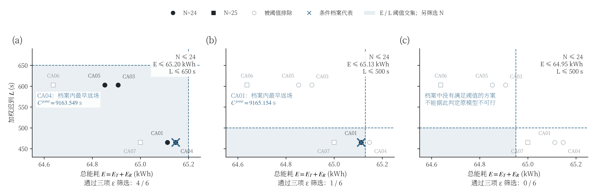
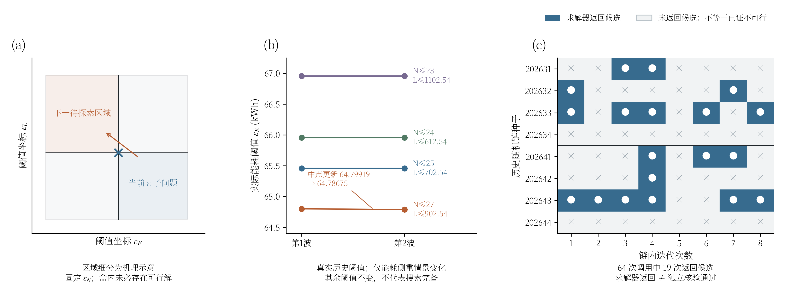
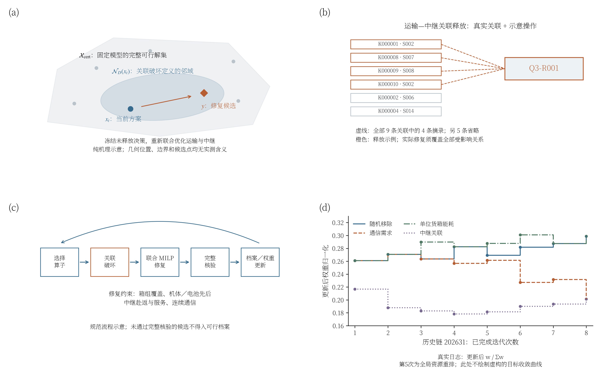
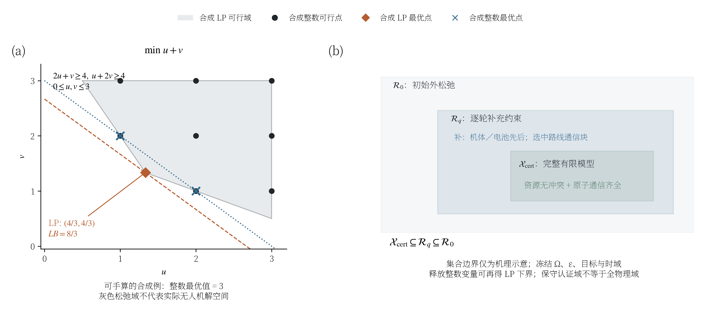
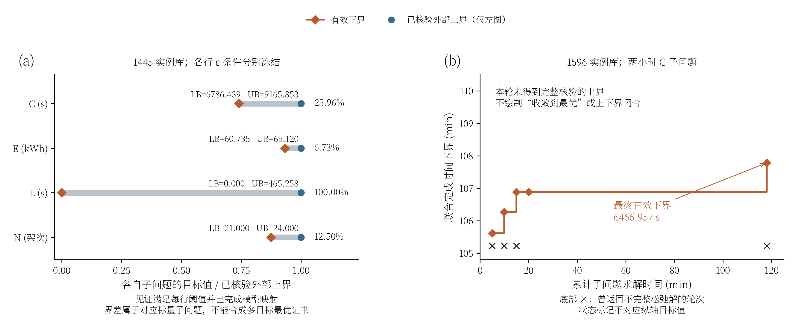

# 问题三：ε约束、自适应搜索、ALNS与松弛下界

本组图参考问题二同类机理图的分面表达，增加问题三特有的运输—中继关联、连续通信认证及联合返场时间。**图1、图2(b)(c)、图3(b)(d)、图5有已有结果或日志依据；其余部分为明确标注的数学例子或方法示意。** 图1的阈值是事后设置的说明情景，不是历史自适应搜索轨迹。

本次仅整理现有结果并绘图，没有重新运行优化。历史核验方案与两小时搜索分别标示：后者新增完整核验方案为0，并不抹去此前已有的核验方案。所有实际搜索结果均限于禁止携带备用电池、仅O01换电的受限策略；专家允许在有电池的其他地点换电，现有数值结果尚未覆盖这一更广策略。

## 1. ε约束如何切分目标空间



**建议图注：** 六个历史核验非支配目标向量在能耗—加权迟到平面的投影。三个面板分别施加不同的架次数、能耗和迟到上限；空心点表示已知方案被阈值排除，蓝色叉号表示通过筛选后按正文词典序选取的档案代表。阴影仅表示能耗与迟到的阈值交集，不代表已经求得的物理可行域。情景(c)没有已知方案满足阈值，不能据此认证模型不可行。实际方案均限于禁止携带备用电池、仅O01换电的受限策略。

沿用正文式（6-28），固定候选库及认证规则，求解

$$
\begin{aligned}
\operatorname{lexmin}_{X}\;&\bigl(C_{\max}^{\mathrm{joint}}(X),L(X),E(X),N(X)\bigr),\\
\mathrm{s.t.}\;&X\in\mathcal X_3^{\mathrm{cert}}(\Omega),\\
&N(X)\le\varepsilon_N,\quad E(X)\le\varepsilon_E,\quad L(X)\le\varepsilon_L,
\end{aligned}
$$

其中

$$
N=N_T+N_R,\qquad E=E_T+E_R,\qquad
C_{\max}^{\mathrm{joint}}=\max\left\{\max_r t^{T,\mathrm{return}}_r,\max_\ell t^{R,\mathrm{return}}_\ell\right\}.
$$

三个情景依次为：

| 情景 | 架次数上限 | 能耗上限/kWh | 加权迟到上限/s | 档案内通过数 | 条件档案代表 |
|---|---:|---:|---:|---:|---|
| (a) | 24 | 65.20 | 650 | 4 | CA04 |
| (b) | 24 | 65.13 | 500 | 1 | CA01 |
| (c) | 24 | 64.95 | 500 | 0 | 无已知代表 |

CA03与CA04的联合完成时间相同，按照正文规定的副目标顺序先比较迟到，故情景(a)选CA04。制图采用完成时间同值容差0.0002 s、迟到同值容差0.000001 s处理历史浮点差异；这只是档案筛选规则，不构成求解器最优性认证。图中条件代表也不是最小最大遗憾决策后的最终提交方案。

本图适合说明：收紧迟到上限会排除低能耗但迟到较大的方案，收紧能耗上限又可能使当前档案出现空缺。不能把六个点连成完整Pareto前沿或拟合成已知可行边界。

## 2. 自适应ε：概念空间与实际探索



**建议图注：** (a)固定架次数阈值下的能耗—迟到阈值区域细分示意，矩形边界没有实测含义；(b)历史两波搜索实际使用的四组能耗阈值及相应架次数、迟到约束；(c)8条历史链共64次调用的候选返回状态。返回候选不等于独立核验通过，未返回候选也不等于已证不可行。实际搜索限于禁止携带备用电池、仅O01换电的受限策略。

图(a)解释如何围绕当前档案空缺和目标取舍设置下一组阈值，不表示代码完成了严格的自适应盒分割或完整枚举。历史程序实际按每波开始时的档案构造四类情景，其中能耗侧重情景采用

$$
\varepsilon_E^{(w)}=
\frac{\min_{X\in\mathcal A_w}E(X)+\max_{X\in\mathcal A_w}E(X)}{2}.
$$

图(b)显示，第二类情景的能耗阈值由64.79918698396384 kWh更新为64.78674627668312 kWh；其他三类情景的阈值未变化。这里的自适应证据是“档案变化后阈值随之更新”，尚不能说明目标空间覆盖充分。

图(c)中19/64次调用返回候选，依据的是历史日志字段`feasible`，该字段在代码中仅判断`p is not None`。因此不报告为19次完整核验成功，也不把该比例当作物理可行率。8条链共享初始及轮间档案，不构成8次独立重复实验。

## 3. ALNS：关联邻域、联合修复与权重反馈



**建议图注：** (a)释放决策集合所定义的ALNS邻域及修复候选示意，位置、边界和点均不代表真实数值；(b)历史核验方案中Q3-R001全部9条运输保障关联中的4条摘录，其余5条省略，另画2条非关联任务，橙色标示联合释放示例，实际修复须覆盖全部受影响关系；(c)以完整核验作为入档条件的规范求解流程；(d)历史链202631记录的四类算子更新后归一化权重。流程示意与历史日志分开解释，不将历史执行等同于已经实现的完整规范流程。实际方案与搜索限于禁止携带备用电池、仅O01换电的受限策略。

设当前方案为$X_t$，关联破坏释放决策索引集合为$D$，其补集为$\bar D$。固定模型内的邻域可表示为

$$
\mathcal N_D(X_t)=
\left\{X\in\mathcal X_3^{\mathrm{cert}}(\Omega):X_{\bar D}=(X_t)_{\bar D}\right\}.
$$

图(a)的二维形状仅帮助理解这一集合关系，不能解释为计算了实际高维离散可行域的投影。若修复MILP暂时省略部分约束，它返回的点还不能归入上述完整可行邻域，必须补约束并通过核验。

问题三的关键在于关联释放：改变一项中继任务的位置或服务时段，会影响其保障的全部运输需求。Q3-R001实际关联9个运输架次，图(b)只摘录其中K000001/S002、K000008/S007、K000009/S008、K000010/S002这4条关联，其余5条为版面清晰而省略；实际释放与修复须覆盖全部受影响保障约束。图中没有声称这次移除实际发生在某一历史迭代。

局部修复同时考虑货箱覆盖、运输和中继任务时序、两侧机体与电池先后、赴返能耗及连续通信。完整核验通过后，才能更新可行档案；失败候选可以提供修复反馈，但不能当作可行上界。

图(d)直接采用历史日志中更新后的权重，纵轴为

$$
\widetilde p_{k,t}=\frac{w_{k,t}^{\mathrm{after}}}{\sum_j w_{j,t}^{\mathrm{after}}}.
$$

它不是当前迭代已经使用的抽样概率，更不是目标偏好权重。历史程序实际执行的单算子更新为

$$
w_k\leftarrow0.8w_k+0.2\max\left(0.15,\frac{S_k}{n_k}\right),
$$

其中$S_k$为该算子的累计奖励，$n_k$为累计记账次数，其他权重保持不变。第5次迭代实际执行强制全局资源重排；程序仍将其奖励记到事先抽出的算子索引。这一历史记账方式意味着权重变化不能直接解释为四种破坏算子的独立性能比较。图(d)保留原日志，没有“修正”或虚构历史轨迹。

## 4. 连续松弛与逐轮补约束



**建议图注：** (a)合成二维整数规划中连续松弛下界与整数最优值的几何关系；(b)固定候选库、ε阈值、目标和时域下，逐轮补回资源及通信约束所形成的外松弛集合包含关系。二维集合边界是方法示意，不是无人机完整物理解空间。

为使几何示意可检查，图(a)采用明确给定的合成模型：

$$
\begin{aligned}
\min\;&u+v,\\
\mathrm{s.t.}\;&2u+v\ge4,\quad u+2v\ge4,\\
&0\le u,v\le3,\quad u,v\in\mathbb Z.
\end{aligned}
$$

放松整数条件后，最优点为$(4/3,4/3)$，$LB=8/3$；整数最优点为$(1,2)$和$(2,1)$，最优值为3。该例只解释松弛原理，不把$u,v$冒充本题架次数或资源数量。

图(b)对应问题三直接联合程序的延迟补约束机制。冻结目标模型，令$\mathcal R_q$为第$q$轮尚未补齐约束的外松弛，则

$$
\mathcal X_3^{\mathrm{cert}}(\Omega)
\subseteq\mathcal R_{q+1}\subseteq\mathcal R_q\subseteq\mathcal R_0.
$$

因此，对同一标量最小化目标$f$，求解器给出的有效对偶下界满足

$$
LB_q\le\min_{X\in\mathcal R_q}f(X)
\le\min_{X\in\mathcal X_3^{\mathrm{cert}}(\Omega)}f(X).
$$

连续放松整数变量会进一步扩大松弛域，也可产生下界，但两小时日志中的`dual_bound`是混合整数求解器对偶界，不能全部称为“根节点LP结果”。同一冻结目标模型的各轮有效下界可以取最大值，补回约束前的整数返回值不能直接作为完整模型上界。

## 5. 有效界差及扩库后的下界进展



**建议图注：** (a)历史1445实例库中四个分别冻结ε条件的标量子问题上下界，以各自经核验外部见证上界归一化，具体条件见本节ε约束表；(b)1596实例库两小时C子问题各轮已记录有效下界的累计最大值。横轴为累计子问题求解时间，阶梯值仅在每轮记录完成时更新；底部叉号是返回不完整松弛候选的状态标记，不表示目标值。该轮没有新增完整核验方案，不绘制新的可行上界。实际搜索及证书限于禁止携带备用电池、仅O01换电的受限策略。

图(a)采用历史汇总中已经记录同域映射及阈值检查通过的外部见证：

| 标量目标 | 下界LB | 外部见证上界UB | 相对界差 |
|---|---:|---:|---:|
| 联合完成时间/s | 6786.438812 | 9165.853228 | 25.96% |
| 总能耗/kWh | 60.735317 | 65.120069 | 6.73% |
| 加权迟到/s | 0 | 465.258411 | 100.00% |
| 总架次数 | 21 | 24 | 12.50% |

所用计算式为

$$
\mathrm{gap}_j=\frac{UB_j-LB_j}{\max(1,|UB_j|)}.
$$

每行固定的其他三个目标上限分别为：

| 主目标 | ε约束（原始记录精度） |
|---|---|
| C | N≤24.000001，E≤65.12007，L≤465.2585 |
| E | N≤24.000001，C≤9165.854，L≤465.2585 |
| L | N≤24.000001，E≤65.12007，C≤9165.854 |
| N | E≤65.12007，C≤9165.854，L≤465.2585 |

表中24.000001是日志中的浮点上限，架次数仍为整数。四行属于不同标量问题，不能合成一个“四目标全局界差”。这里的外部见证也不能与图1当前共同档案代表混用。

图(b)的新候选库包含1596个实例，C子问题保持上表C行阈值。其最终记录的有效下界为6466.957058 s。各轮下界均针对同一冻结目标模型，采用

$$
\widehat{LB}_q=\max_{0\le i\le q:\,LB_i\text{有效}}LB_i.
$$

该曲线是日志中已记录界的阶梯汇总，未记录的轮内进展不能从图中推断。没有返回下界的轮次仅延用此前有效界。两小时搜索4个全库进程及2个邻域进程均未带来新的完整核验方案；不能据此说明不存在改进方案。

**旧库和新库的上下界不可直接拼接。** 候选扩充可能扩大可行域，较大库的下界低于旧库并不反常；在尚未完成同域见证检查前，不将旧上界与新下界组合报告新的认证界差。全部证书仍限于指定候选库、位置高度、时域、通信认证及O01换电策略，而非原始连续物理问题的全局最优认证。

## 6. 文件、复现与正文引用

每幅图均提供300 dpi PNG、矢量PDF及可编辑文字SVG。数据来源及SHA-256保存在`mechanism_data.json`；`数据摘录/`提供便于复核的CSV；`核验记录.json`记录制图数据与导出文件检查。各图单独的Python脚本可以编辑布局，`plot_style.py`统一配色和字体。

使用既有Anaconda环境复现：

```powershell
& 'E:\tool\anaconda3\python.exe' 'D:\研究生\比赛\数学建模\2026\问题三\机理图\run_all.py'
```

`run_all.py`只读取已有结果、绘图和导出摘录，不启动优化。字体使用Noto Serif SC、Times New Roman和STIX，SVG在其他设备编辑时需要相应字体。

建议将图1—2放在正文6.2.3的ε搜索说明，图3放在ALNS邻域及局部修复说明，图4—5放在6.3.4的求解质量说明。LaTeX图注及引用片段在`latex_includes.tex`。本次图文独立保存在问题三目录，未替换正文已有图片引用。

主要来源：

- `问题三/搜索精修/扩展固定结构精修_v1/共同档案重评/目标去重共同档案.json`
- `问题三/搜索精修/扩展固定结构精修_v1/official/已核验方案.json`
- `问题三/日志/搜索记录.json`
- `问题三/搜索精修/扩展固定结构精修_v1/扩展搜索汇总.json`
- `问题三/扩展搜索后台/两小时_20260924_045708_v2/全库_C/直接联合MILP结果.json`
- `正文/正文.md`第6.2.3和6.3.4节；`问题三/solve_q3.py`的历史阈值与权重更新逻辑。
