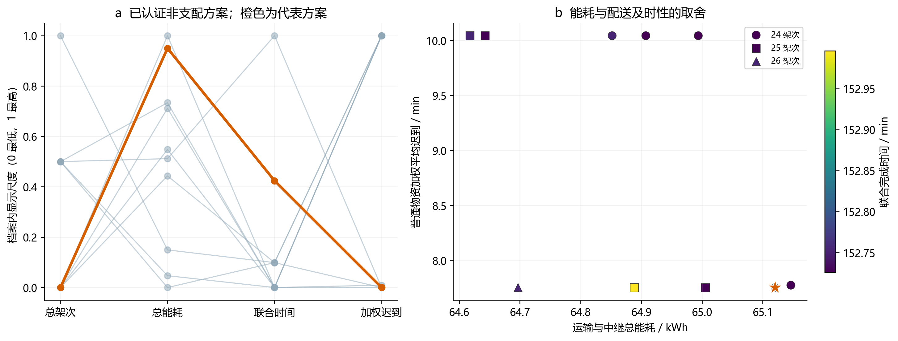
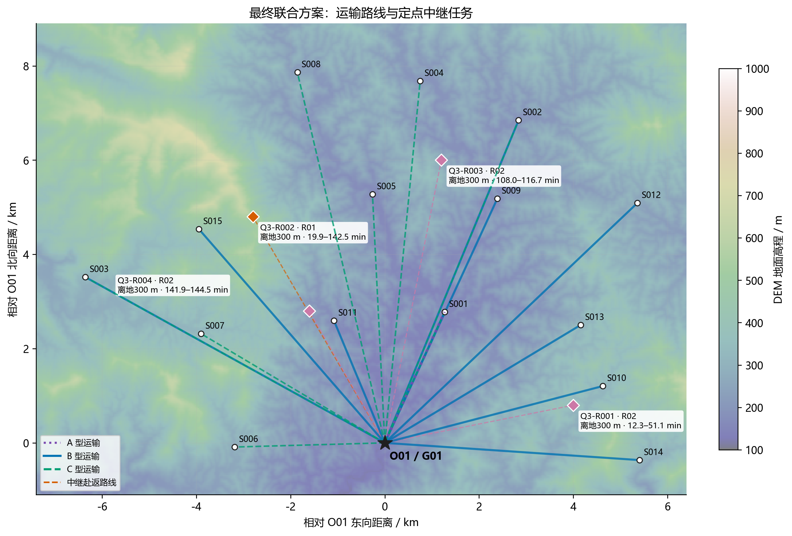
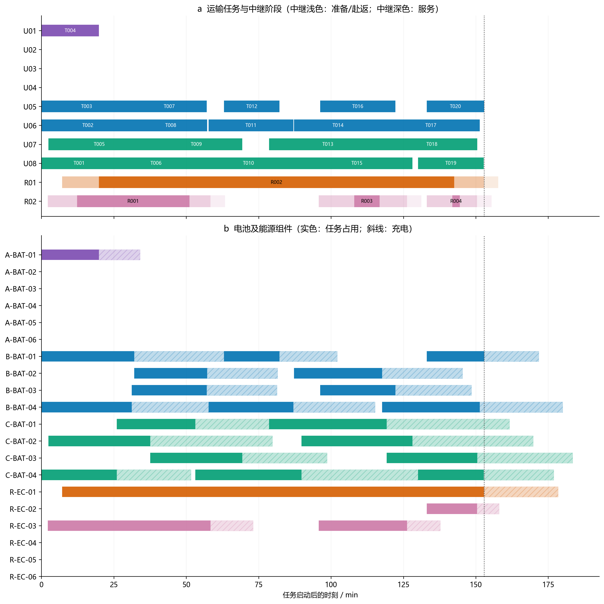
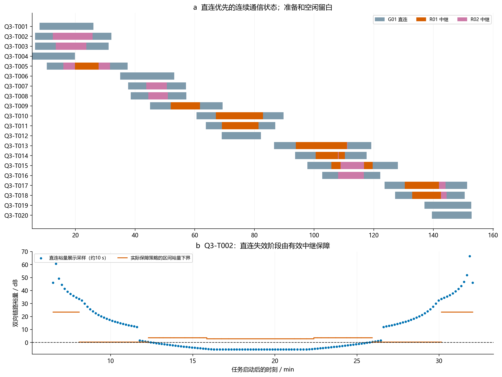

# 问题三求解结果

最终提交的是一套联合调度方案：**20个运输架次、4个中继架次，80箱全部交付**。31箱医疗或首批保障物资满足硬时限。普通物资的期望时间为软目标，49箱中5箱迟到，不能表述为全部80箱按期望时间送达。

## 一、子问题一：联合优化与目标权衡

| 指标 | 结果 |
| --- | --- |
| 运输+中继总架次 | 24 |
| 运输能耗 / kWh | 60.917526 |
| 中继能耗 / kWh | 4.202543 |
| 总能耗 / kWh | 65.120069 |
| 联合完成时间 / s | 9170.432679 |
| 普通物资加权平均迟到 / s | 465.258411 |
| 档案内遗憾 | 0.00046999 |
| 保守遗憾上界 | 1.87291553 |

采用自适应ε约束、运输—中继关联移除/重构、局部MILP修复和偏好不确定性决策。偏好中心为四目标等权，L1半径0.3，计算12个极点。最终按有效外松弛得到的遗憾上界最小选择；这不是把四项单独最好的数值拼接成一行。

正式搜索为2轮、每轮4条种子链、每链8步；链之间共享初始/轮间档案，不能称为8次独立完整重复实验。补充计算对适配任务尝试A型机改派，并复用相同需求、地形和通信认证联合调整中继与时刻。资源敏感性得到的方案若在原库存下仍可行，也合并到档案后重新比较。共保存10个已独立认证的非支配方案；不将尚未完成的消融或10次独立重复写成已完成。

| 方案 | 运输+中继架次 | 总能耗 / kWh | 联合完成 / s | 加权迟到 / s |
| --- | --- | --- | --- | --- |
| A 冻结Q2快照后配置中继 | 20+5 | 64.719111 | 9169.188 | 602.544 |
| B 固定箱组/机型/资源顺序重排 | 20+4 | 64.852056 | 9165.154 | 602.544 |
| C 联合搜索最终代表 | 20+4 | 65.120069 | 9170.433 | 465.258 |

A使用问题二初始化快照，并不代表问题二目录的最新结果。B固定箱组、机型及运输资源身份/顺序，只开放时刻与中继；C开放结构邻域及改派。此处是不同求解范围下的可行方案对照，各方法累计预算不同，不据此宣称算法统计优越。

固定累计路线库外松弛的完成时间下界为6309.363 s，相对可行上界差为31.20%。该下界先删除全部通信采样约束，再放松资源先后、整数和中继约束，仅保留分类覆盖、机型总工作量以及适用的架次/能耗上限；有效但较弱，**不能证明全路线、连续空间的全局最优**。归一化尺度由初始方案冻结，后续方案优于初始参考时允许出现负归一化值。

## 二、子问题二：最终联合调度与可行性

### 运输架次

| 架次编号 | 无人机编号 | 机型编号 | 电池编号 | 开始时刻（s） | 访问服务区顺序 | 返回O01时刻（s） | 架次能耗（kWh） |
| --- | --- | --- | --- | --- | --- | --- | --- |
| Q3-T001 | U08 | C | C-BAT-04 | 0.000 | O01→S006→O01 | 1561.553 | 2.598 |
| Q3-T002 | U06 | B | B-BAT-01 | 0.000 | O01→S012→O01 | 1922.827 | 2.753 |
| Q3-T003 | U05 | B | B-BAT-04 | 0.000 | O01→S014→O01 | 1869.748 | 2.140 |
| Q3-T004 | U01 | A | A-BAT-01 | 0.000 | O01→S001→O01 | 1190.907 | 1.220 |
| Q3-T005 | U07 | C | C-BAT-02 | 144.397 | O01→S002→O01 | 2252.240 | 6.281 |
| Q3-T006 | U08 | C | C-BAT-01 | 1561.553 | O01→S001→O01 | 3187.728 | 2.566 |
| Q3-T007 | U05 | B | B-BAT-03 | 1869.748 | O01→S010→O01 | 3425.151 | 1.823 |
| Q3-T008 | U06 | B | B-BAT-02 | 1922.827 | O01→S013→O01 | 3433.338 | 1.825 |
| Q3-T009 | U07 | C | C-BAT-03 | 2252.240 | O01→S007→O01 | 4159.840 | 3.411 |
| Q3-T010 | U08 | C | C-BAT-04 | 3187.728 | O01→S008→O01 | 5387.439 | 5.836 |
| Q3-T011 | U06 | B | B-BAT-04 | 3463.906 | O01→S002→O01 | 5220.630 | 2.361 |
| Q3-T012 | U05 | B | B-BAT-01 | 3782.306 | O01→S001→O01 | 4931.412 | 1.220 |
| Q3-T013 | U07 | C | C-BAT-01 | 4716.614 | O01→S003→O01 | 7152.791 | 6.325 |
| Q3-T014 | U06 | B | B-BAT-02 | 5231.607 | O01→S015→O01 | 7059.934 | 2.308 |
| Q3-T015 | U08 | C | C-BAT-02 | 5387.439 | O01→S004→O01 | 7688.494 | 6.153 |
| Q3-T016 | U05 | B | B-BAT-03 | 5774.986 | O01→S009→O01 | 7333.449 | 2.096 |
| Q3-T017 | U06 | B | B-BAT-04 | 7059.934 | O01→S003→O01 | 9080.544 | 2.424 |
| Q3-T018 | U07 | C | C-BAT-03 | 7152.791 | O01→S005→O01 | 9029.980 | 4.222 |
| Q3-T019 | U08 | C | C-BAT-04 | 7801.374 | O01→S001→O01 | 9163.549 | 2.281 |
| Q3-T020 | U05 | B | B-BAT-01 | 7982.008 | O01→S011→O01 | 9170.433 | 1.074 |

### 中继架次

| 中继架次编号 | 中继无人机编号 | 能源组件编号 | 开始时刻（s） | 悬停经度（°） | 悬停纬度（°） | 悬停海拔（m） | 建链完成时刻（s） | 服务结束时刻（s） | 返回O01时刻（s） | 架次能耗（kWh） |
| --- | --- | --- | --- | --- | --- | --- | --- | --- | --- | --- |
| Q3-R001 | R02 | R-EC-03 | 131.594 | 109.26986996 | 23.01573336 | 626.454 | 738.230 | 3066.104 | 3504.303 | 0.939 |
| Q3-R002 | R01 | R-EC-01 | 428.222 | 109.20353892 | 23.05185266 | 856.955 | 1191.001 | 8552.303 | 9165.853 | 2.560 |
| Q3-R003 | R02 | R-EC-03 | 5743.706 | 109.24255718 | 23.06268844 | 607.763 | 6481.644 | 7004.924 | 7572.867 | 0.472 |
| Q3-R004 | R02 | R-EC-02 | 7983.751 | 109.21524440 | 23.03379301 | 549.776 | 8514.263 | 8669.855 | 9025.540 | 0.232 |

时刻均从任务启动算起。“开始”是开始准备；Excel保留原始精度，以上只作显示舍入。最终使用运输机A/B/C分别为1/2/2架，匹配电池分别1/4/4组；中继使用2架机体和3个不同能源组件。未使用的库存仍存在，不把实际使用量当成独立完成任务的最小资源需求。

硬时限最小裕度为0.000000 s；存在恰好到达截止时刻的任务。最低运输返航SOC为20.9425%，最低中继返航SOC为20.0000%。实际最后返場任务是Q3-T020；末次充电与中继周转不延长题目定义的联合完成时间。

### 连续通信与独立核验

从原始Excel、原DEM和实际箱号重新计算；不复用求解器缓存的真假覆盖标记。共803项核验通过，覆盖箱组、时限、三维飞行与能源、机体/电池/组件占用及通信。每个仿射运动阶段利用三维扫掠三角形与闭DEM像元裁剪得到整段保障证书，直连失败时核验同一中继的接入和回传。当前最小证书裕量下界为0.017859 dB。

通信结果表含174段。直连优先状态由地形遮挡事件和距离门限球交点划分，并对497个阶段/切换端点单独检查。边界时刻以`通信事件端点核验.csv`的实际保障主体为准；共享边界不表示同时接受两架中继服务。展示用约10 s裕量采样只用于图形，连续结论来自区间及端点认证。通信规则仅相对于题给30 m DEM和简化传播模型。

### 输出与复现

- `问题三_结果提交.xlsx`：仅填Q3原有两表及Q3运输、逐箱补充页；所有数值来自同一最终方案。
- `子问题二/最终方案.json`：正式编号方案，含通信关系，可供问题四冻结继承。
- `子问题二/最终运输架次.csv`、`最终中继架次.csv`、`最终逐箱交付.csv`、`最终通信保障.csv`、`最终资源占用.csv`：完整可机读结果。
- `子问题一/非支配方案与遗憾.csv`、`资源敏感性.json`、`偏好半径敏感性.json`：权衡与有限对照。
- `子问题二/独立核验结果.json`、`全区间通信证书.csv`、`通信事件端点核验.csv`、`Excel回读核验.json`：核验依据。

数值范围：24个中继位置/高度候选，100/200/300 m高度层；水平初始区间200 m、垂直100 m，未认证区间最多细分4层；每实体中继最多3个架次槽，搜索时域30000 s；累计1292个运输候选及其显式副本。候选路线允许1至3个不同服务区，本次代表最终选中的运输架次均为单服务区；这不是证明多点访问无益。

两张RTX 3080 Ti实际参与候选传播/遮挡筛选，每卡完成52,952,280次射线采样计算；其后由CPU作完整几何认证与MILP。CPU采用4个并行优化任务，每任务1个求解线程，几何预计算10线程。DEM、航段和证书驻留内存重复使用，具体测量与环境见`计算资源记录.json`和`运行环境.md`。没有为了占满资源制造无效计算。运行命令见`README.md`。
