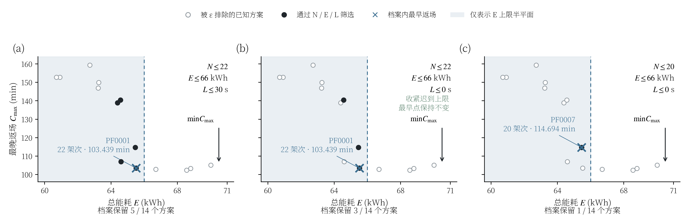
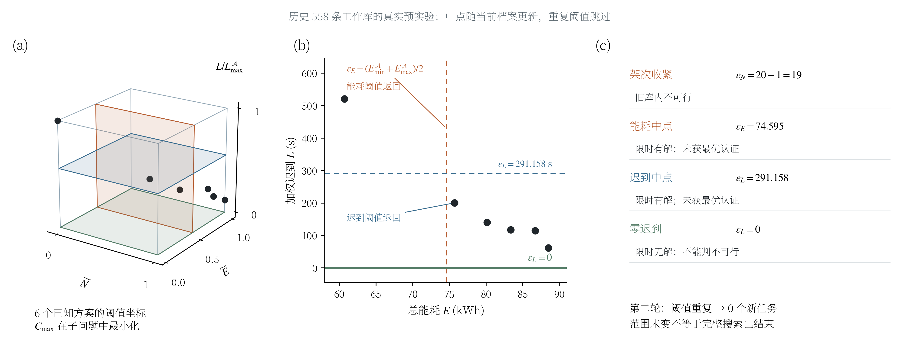
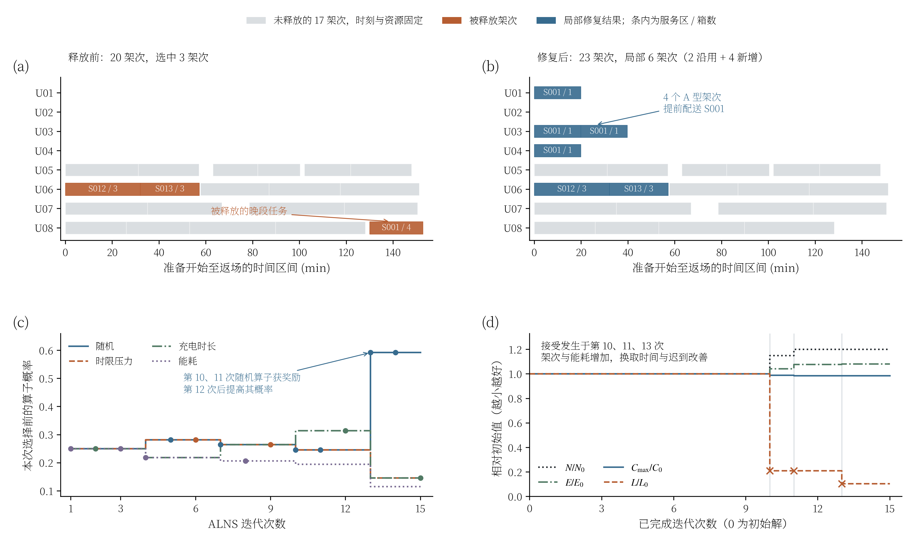
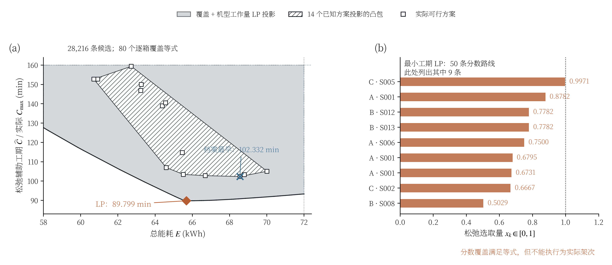
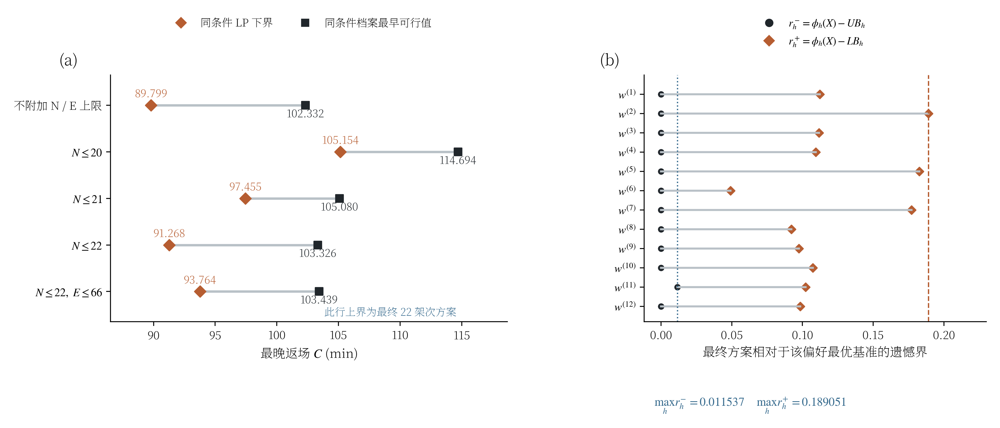

# 问题二：求解空间与算法过程机理图

本图册沿用问题一机理图的白底、蓝橙对比、分面编号与矢量排版。问题二包含架次 $N$、总能耗 $E$、最晚返场时间 $C_{\max}$、加权迟到 $L$ 四个目标。因此采用“二维投影＋其余目标条件”和分面展示，不把四目标空间误画成完整二维可行域。

所有图均由 Python 根据保存的结果或实际LP计算绘制。图1、图4和图5使用最新28216条冻结候选库及14个联合非支配档案方案；图2、图3使用旧558条工作库的真实预实验日志。两类数据不是同一次求解轨迹。

本文图中的 $C_{\max}$ 是所有运输无人机完成最后一个架次并返回 O01 的最晚时刻；图示单位为分钟，源结果中单位为秒。它不是所有架次时间之和。$L$ 保留原冻结模型的加权迟到口径，单位为秒。

## 图册导航

| 图 | 内容 | 建议插入位置 |
|---|---|---|
| 1 | ε阈值筛选与目标权衡 | ε约束子问题公式之后 |
| 2 | 自适应阈值平面及真实试探状态 | 自适应ε搜索规则之后 |
| 3 | ALNS破坏—修复及算子学习 | ALNS求解过程或简化对照部分 |
| 4 | 整数方案与连续松弛的空间关系 | 有效下界推导之后 |
| 5 | 时间界差及偏好遗憾区间 | 结果可信度与最终决策部分 |

目前独立交付图册，正文中已有图片引用继续保留。每张图均提供同名 PNG、SVG、PDF，PNG 为320 dpi，PDF为矢量输出。SVG保留可编辑文字，需要相应字体；PDF嵌入字体，适合论文排版。


## ε约束选取：四目标条件筛选



**图注：** 最终档案中14个已核验方案的能耗—最晚返场时间投影。迟到上限由30 s收紧至0 s时，符合条件的方案由5个减少至3个，档案内最早返场方案保持不变；进一步将架次上限收紧为20后，仅余1个方案。蓝色背景仅表示能耗上限，标记同时考虑架次和迟到条件。结果为有限档案筛选，不构成ε子问题全局最优认证。

[矢量PDF](图1_epsilon约束与四目标条件筛选.pdf) · [可编辑SVG](图1_epsilon约束与四目标条件筛选.svg)

### 如何理解

令 $\mathcal X_{K}$ 表示冻结候选库 $K$ 对应的完整联合调度可行集。ε约束子问题写为

$$
\underset{X\in\mathcal X_K}{\operatorname{lexmin}}
\bigl(C_{\max}(X),L(X),E(X),N(X)\bigr),
\qquad
N(X)\le\varepsilon_N,\quad E(X)\le\varepsilon_E,\quad L(X)\le\varepsilon_L.
$$

其中首先最小化 $C_{\max}$，后续目标用于依次打破平局。图1将 $\mathcal X_K$ 替换为已知14方案档案 $\mathcal A$ 做筛选，从而用真实点解释阈值如何作用。它没有重新求解完整ε子问题。

空心点表示未通过全部条件；黑点表示同时满足三个上限；蓝叉表示保留档案内最早返场点。蓝色半平面本身只表示 $E\le66$，不能单凭点落入阴影就判断可行。

| 面板 | ε条件 | 档案保留数 | 所选方案 | 最晚返场/min |
|---|---|---:|---|---:|
|(a)|N≤22，E≤66，L≤30|5|PF0001|103.439074|
|(b)|N≤22，E≤66，L≤0|3|PF0001|103.439074|
|(c)|N≤20，E≤66，L≤0|1|PF0007|114.694264|

前两幅图的最早点均为 PF0001，这准确反映了“阈值收紧后最优标记可能保持不动”；第三幅图显示架次上限由22收紧至20后，当前档案内需要更长完成时间。PF编号仅对应本次冻结档案。


## 自适应ε：阈值平面、试探与状态



**图注：** 旧558条候选工作库上的自适应ε阈值构造与实际求解状态。档案范围生成架次减一、能耗中点、迟到中点及零迟到四种试探；对应状态来自各自任务日志。第二轮阈值重复而跳过，本次有限试探不代表完整目标空间枚举。

[矢量PDF](图2_自适应epsilon阈值与真实求解状态.pdf) · [可编辑SVG](图2_自适应epsilon阈值与真实求解状态.svg)

### 如何理解

每轮从当前非支配档案 $\mathcal A_t$ 计算各目标最小值与最大值。保存代码实际采用以下试探：

$$
\varepsilon_N=\max\{1,N_{\min}^{\mathcal A_t}-1\},\qquad
\varepsilon_E=\frac{E_{\min}^{\mathcal A_t}+E_{\max}^{\mathcal A_t}}2,
$$

$$
\varepsilon_L=\frac{L_{\min}^{\mathcal A_t}+L_{\max}^{\mathcal A_t}}2,
\qquad \text{并单独试探 }\varepsilon_L=0.
$$

四次试探分别只收紧相应目标，其余上限取当前档案最大值。得到新可行方案后更新档案，再计算下一轮阈值；重复阈值跳过。

三维面板的坐标是 $\widetilde N=(N-N_{\min}^{\mathcal A})/(N_{\max}^{\mathcal A}-N_{\min}^{\mathcal A})$、$\widetilde E$ 的同类归一化量，以及 $L/L_{\max}^{\mathcal A}$。绿色平面表示物理上的零迟到，不能把它误认为“样本最小迟到”。$C_{\max}$ 在子问题中最小化，不在这组三维坐标上。

| 试探 | 架次上限 | 能耗上限/kWh | 加权迟到上限/s | 实际状态 |
|---|---:|---:|---:|---|
|1|19|88.484787|520.799807|旧库内已证不可行|
|2|35|74.594880|520.799807|限时有解，未获最优认证|
|3|35|88.484787|291.158096|限时有解，未获最优认证|
|4|35|88.484787|0.000000|限时未获可行解，不能判不可行|

“限时未获可行解”不等于不可行。第二轮没有新阈值，说明该试探规则在当时档案上重复，并不说明完整目标空间已经被穷尽。图中没有虚构后续自适应轮次或“不断逼近完整前沿”的轨迹。


## ALNS：释放、修复、概率和目标变化



**图注：** 旧候选库上一次15步ALNS运行及第10次局部修复。释放3架次后，局部解包含2条沿用路线和4条新增路线；其余17架次的资源与时刻固定。下排显示本次选择前的算子概率和按接受事件重建的当前解目标轨迹。架次与能耗增加，同时完成时间和迟到降低。

[矢量PDF](图3_ALNS破坏修复与自适应算子.pdf) · [可编辑SVG](图3_ALNS破坏修复与自适应算子.svg)

### 如何理解

面板(a)(b)展示第10次迭代。释放3条路线涉及10箱：B型的 S012、S013 各3箱，以及C型的 S001 共4箱。修复后，前两条B型路线沿用，S001拆为4条A型单箱路线。局部结果由3架次变为6架次，全方案由20架次变为23架次；未释放的17架次在保存方案中保持原无人机、电池、开始与结束时刻。

甘特条展示“准备开始至返场”的无人机占用区间，不单独表示纯飞行时长。它也不替代电池SOC、位置和充电资源的完整可行性核验。

| 状态 | 架次 | 能耗/kWh | 最晚返场/min | 加权迟到/s |
|---|---:|---:|---:|---:|
|释放前|20|60.704972|152.725814|520.799807|
|第10次修复并接受后|23|63.260212|151.159454|109.801398|

四个破坏算子为随机、时限压力、充电时长和能耗。第 $t$ 次选择前的概率为

$$
p_i^{(t)}=\frac{w_i^{(t)}}{\sum_jw_j^{(t)}}.
$$

每3次迭代更新一次权重。对于该段内被使用的算子，更新规则为

$$
w_i\leftarrow\max\left\{0.05,\;0.75w_i+0.25\frac{\sum r_i}{n_i}\right\}.
$$

奖励优先级为：新增非支配解8分；否则字典序改进4分；否则被接受1分；有效候选被拒绝0.1分。该运行中的概率、奖励和权重更新已逐轮复算。

保存代码还包含温度接受规则：在未按字典序改善且工期差异超出容差时，以 $\min\{1,\exp(-\Delta/T_t)\}$ 尝试接受，$\Delta$ 为相对初始工期的变化，$T_t=0.03\times0.94^t$（$t$从0开始）。但这15步日志不能支持“已通过退火接受劣解跳出局部最优”的结论。

面板(d)按 `accepted` 重建当前解，而非直接连接所有候选结果。接受发生于第10、11、13次；迟到明显减少，架次和能耗同时增加。因此该图表达的是目标权衡，不是四目标同时改善。历史15步对照也不能作为ALNS与全局求解器的全面性能比较。


## 松弛下界：投影几何与分数路线



**图注：** 最终28216条候选库的覆盖—机型工作量松弛在能耗与辅助工期显示窗内的投影，以及14个已知可行方案投影的凸包。边界通过原LP支持函数逐边数值核验；点状线表示人工显示窗边界。斜线凸包内部和右图中的分数路线均不代表可执行调度。该下界仅适用于相同候选库和物理假设。

[矢量PDF](图4_覆盖工作量松弛域与分数解.pdf) · [可编辑SVG](图4_覆盖工作量松弛域与分数解.svg)

### 松弛模型与几何关系

设 $x_k$ 表示候选路线 $k$ 的选取量，$a_{bk}$ 表示箱 $b$ 是否被路线 $k$ 覆盖，$e_k$ 为路线能耗，$\tau_k$ 为无人机占用时长（分钟），$K_g$ 为机型 $g$ 的候选路线集合，$m_g$ 为该机型无人机数量。当前机队 $m_A=4,m_B=2,m_C=2$，共80箱。

本图使用“逐箱覆盖＋按机型累计工作量”的连续松弛：

$$
\min\ \widehat C,
$$

$$
\sum_{k\in K}a_{bk}x_k=1\quad(\forall b),\qquad 0\le x_k\le1,
$$

$$
\sum_{k\in K_g}\tau_kx_k\le m_g\widehat C\quad(g=A,B,C),\qquad \widehat C\ge0.
$$

在相应情景中额外加入

$$
\sum_kx_k\le\varepsilon_N,\qquad \sum_ke_kx_k\le\varepsilon_E.
$$

每个可执行调度都满足逐箱覆盖和机型工作量必要条件。将其开始时刻、排序和物理电池等变量消去，取 $x_k\in\{0,1\}$、$\widehat C=C_{\max}$ 后，可映射到该松弛多面体。松弛允许分数选取，并舍去详细调度约束，故其最小值构成**同一候选库及物理假设下**的有效下界。

定义松弛目标投影

$$
\Pi(x,\widehat C)=\left(\sum_ke_kx_k,\widehat C\right),
\qquad
\mathcal Y_K=\{(E(X),C_{\max}(X)):X\in\mathcal X_K\}.
$$

对已知档案的投影 $\mathcal Y_{\mathcal A}$，有

$$
\operatorname{conv}(\mathcal Y_{\mathcal A})
\subseteq\operatorname{conv}(\mathcal Y_K)
\subseteq\Pi(P_{\rm workload}).
$$

图中斜线区只是14个已知方案的投影凸包；其内部的混合点通常不能作为一个完整调度执行，也不是已求得的“全体整数可行域凸包”。灰色区是覆盖—工作量松弛的投影，不是旧联合MILP全部变量连续松弛的精确投影。

绘图显示窗为 $58\le E\le72$ kWh、$85\le\widehat C\le160$ min。上边界、右边界等人工裁切线采用点状线。程序以二维支持函数LP逐边细化投影，共 50 个顶点、98 次不同方向支持查询，归一化支持残差不超过 $2\times10^{-8}$。这些是数值容差内的边界核验，不是有理数精确证书。

最小工期松弛值为 **89.798721 min**，其解含 **50 条分数路线**。右图列出其中9条；相同“机型·服务区”可能对应不同箱子组合，其完整候选ID保存在[松弛分数路线.csv](松弛分数路线.csv)。所有14个已知方案点均通过松弛投影包含性核验。


## 下界核验：同条件界差与偏好遗憾



**图注：** 相同最终候选库下五种约束情景的时间松弛下界与对应档案最早可行上界，以及最终方案在12个冻结偏好极点上的遗憾上下界。所有比较保持候选库、评价尺度和情景条件一致。区间表示松弛下界至已知可行上界的差距，不提供完整原问题全局最优认证。

[矢量PDF](图5_同条件下界与最坏遗憾区间.pdf) · [可编辑SVG](图5_同条件下界与最坏遗憾区间.svg)

### 同条件时间上下界

| 附加条件 | 松弛下界/min | 档案最早可行上界/min | 相对上界差距/% |
|---|---:|---:|---:|
|无附加N/E上限|89.798721|102.332219|12.248|
|N≤20|105.154226|114.694264|8.318|
|N≤21|97.455009|105.079981|7.256|
|N≤22|91.268126|103.325593|11.669|
|N≤22且E≤66 kWh|93.763872|103.439074|9.354|

差距采用 $(UB-LB)/UB$。这里的 $UB$ 是相同情景下14档案中的最早可行工期；相同有限库联合模型的最优工期位于该上下界之间，但区间内的具体值尚未求精。无附加上限时的档案最早方案为23架次；最后一行的上界对应最终综合代表方案的 103.439074 min，两者优化含义不同。该代表方案为22架次，不作为N≤20或N≤21行的可行上界。

### 偏好遗憾如何连接最终选择

继续使用已冻结的四目标尺度 $s$ 和偏好集合，不按新图中的范围重新缩放：

$$
\mathcal W=\left\{w\ge0:\mathbf1^\top w=1,\;\left\|w-(1/4,1/4,1/4,1/4)\right\|_1\le0.3\right\}.
$$

该集合有12个极点。图中按原存储顺序逐个画离散区间，不用平滑曲线暗示连续趋势。对于每个极点 $w^{(h)}$，采用相同系数和常数平移约定：

$$
\phi_h(X)=\sum_{j=1}^{4}\frac{w_j^{(h)}}{s_j}F_j(X),\qquad
LB_h\le\phi_h^*\le UB_h.
$$

若正文写成减去理想参考点的归一化形式，所有基准须同时减去对应常数；两者得到的遗憾相同。基准 $LB_h$ 沿用最终结果中的覆盖—工作量松弛值（迟到放松为0），$UB_h$ 由14个档案方案逐个评价得到。

$$
r_h^-(X)=\phi_h(X)-UB_h,
\qquad r_h^+(X)=\phi_h(X)-LB_h,
$$

$$
\max_h r_h^-(X)\le R(X)\le\max_h r_h^+(X).
$$

当前最终方案本身属于计算 $UB_h$ 的档案，故图中的各差值非负。最终最坏遗憾区间为 **[0.011536647, 0.189051086]**；两个最大值不要求来自同一偏好极点。图册复算了可行基准上界与遗憾差值，时间LP下界另行独立重解；偏好LP下界来自带求解状态的最终基准文件。

**89.799 min不能直接解释为完整原问题的最优完成时间。** 专家允许在具有电池的站点换电；当前候选库对应的方案空间采用每架次一电池、O01换电。有限库下界适用于这一限定模型，不能未经证明外推到允许站外换电和全部未生成路线的完整空间。图中的“档案最早”“综合代表”“松弛下界”分别标注，避免混淆。


## 复现与核验

在项目根目录执行以下命令，默认只重绘并更新本图册；加 `--recompute` 才重新构建数据和LP投影。

```powershell
& 'E:\tool\anaconda3\python.exe' '问题二/机理图/run_all.py'
& 'E:\tool\anaconda3\python.exe' '问题二/机理图/run_all.py' --recompute
```

每图有独立 `fig01_*.py` 至 `fig05_*.py`，共享 `plot_style.py`。`compute_data.py` 提取并核验源数据；`mechanism_data.json` 保存图中实际数值、校验结论和输入SHA256。`上下界核验.csv`、`松弛分数路线.csv`、`LP求解记录.csv` 可直接核查数值；`latex_includes.tex` 提供论文插图代码。`validate_artifacts.py` 校验源文件指纹、PNG尺寸、SVG结构以及PDF文件结构。

本次绘图处理的是稀疏LP和少量矢量图形，CPU并行重绘即可；没有将未使用的GPU资源描述为已用于加速。未重新运行正式全局搜索或ALNS求解，现有最终提交方案与正文保持原样。

### 数据来源

- 图1：`../最终求解_20260924/联合非支配档案.json`、`最终方案.json`。
- 图2：`../子问题二/构造初始化档案.json`、`自适应epsilon.json`、`完整联合运行日志.json`。四个状态按任务标签对应，未将两个返回解错误地逐项配给四组阈值。
- 图3：`../子问题二/ALNS对照日志.json`、`ALNS对照档案.json`，算子与接受规则对照 `../q2_run.py`。
- 图4：`../最终求解_20260924/frozen_evaluation_candidates.json.gz` 和原始箱子、机队输入；本次使用 SciPy/HiGHS 重建LP。
- 图5：本次重解时间下界，对照 `../改进搜索_20260924/89分钟与20至22架次_下界核查.json`；偏好基准来自 `../最终求解_20260924/偏好极点基准_扩大库松弛.json`，尺度来自 `../冻结评价配置.json`。

### 已执行的数值检查

- 四组ε阈值与日志一致：通过。
- 15次算子概率和权重更新一致：通过。
- ALNS释放与修复的箱子集合守恒：通过。
- 17条固定任务的资源和时刻一致：通过。
- 五种情景时间LP下界与原核查一致：通过。
- LP投影各边支持残差在数值容差内：通过。
- 14个档案点均处于LP投影内：通过。
- 最终偏好上界与遗憾上界复算一致：通过。

每幅PNG均重新打开检查标签与图例；独立同系列审阅代理对五图含义、数据来源和结论范围进行了复核，记录另存于本目录。该审阅是辅助检查，不等同于外部专家背书或最优性证明。
